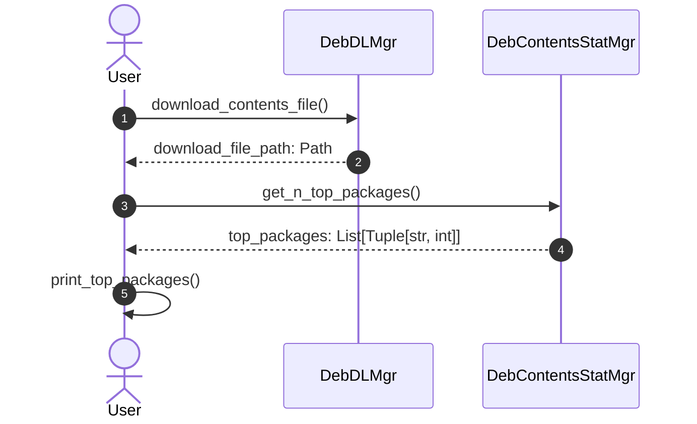

# debian_package_stats
Command line application for running statistics over debian packages.

```mermaid
sequenceDiagram
   autonumber
   actor User
   User->>DebDLMgr: download_contents_file()
   DebDLMgr-->>User: download_file_path: Path
   User->>DebContentsStatMgr: get_n_top_packages()
   DebContentsStatMgr-->>User: top_packages: List[Tuple[str, int]]
   User->>User: print_top_packages()
```
